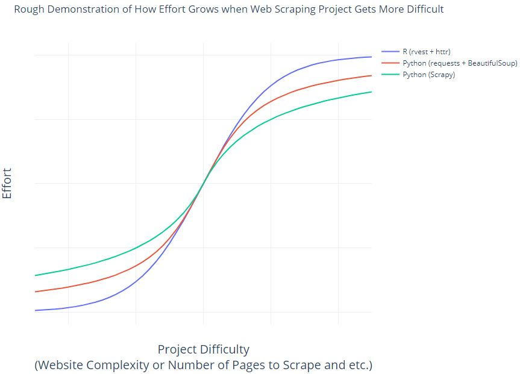

# web-scraping-examples

**This repo is working in progress**

This repo includes working codes to scrape https://books.toscrape.com/

Tools Comparision:

- Python: 
  - requests, BeautifulSoup: 
    - Use Case: Usually used for smaller projects such as scrape websites with simple structures or scrape only a few pages.
    - Pros: Light weight and easy to use. Can be used with jupyter notebook and be part of data analytics/data science workflow or easily intergrated in serveless workflows such as AWS Lambda.
    - Cons: The codes get harder to manage when website structure becomes more complicated.  
  - scrapy: 
    - Use Case: Scrapy is much more powerful and can be used on large-scale webscraping with many useful functionalities built in.
    - Pros: It has built-in caching, asynchronous requests, proxy and user agent randomnization and etc. It also includes useful modules that streamline web scarping workflow.
    - Cons: Learning curve for Scrapy is steeper. You need to invest more item to get familiar with it even when you're good at webscraping using requests and BeautifulSoup.
- R: **TO DO**
  - httr, rvest: For reference, you can check [Cheat Sheet for Web Scraping using R](https://github.com/yusuzech/r-web-scraping-cheat-sheet)
    - Use case: Similar to requests and BeautifulSoup, usually used for smaller projects such as scrape websites with simple structures or scrape only a few pages.
    - Pros: Easy to learn and use, with R's strength in vectorized calcuations. The codes are simpler comparing to use requests and BeautifulSoup. Also, you can do web scraping in R studio as part of data analytics or data science workflow. No need to learn another language only for the purpose of doing some web scraping.
    - Cons: Similar to requests and BeautifulSoup, the codes get harder to manage when website structure becomes more complicated.  

## Effort for Web Scraping with Different Toolset

- R (rvest + httr)
  - If you're already familiar with R, then R is the simplest when the project is small, because it has vectorized functions to extract text or attributes from websites.
  - As the project becomes more difficult, it's hard to use R for web scraping effectively. Because R is originally built for statistical analysis and not for general programming, it's could get harder to manage the codes as project difficulty increases.
- Python (requests + BeautifulSoup)
  - When working on easier projects, this combination is very easy to use. There isn't much upfront cost comparing to use scrapy. You don't need to set up a lot of modules and settings with requests and BeautifulSoup.
  - As the project becomes more difficult, you may find that you need to write your own functions or classes to handle all different cases. Comparing what is offered in Scrapy, it's like you are re-inventing wheels that's already provided in Scrapy.
- Python (Scrapy)
  - Even when you're already familar with webscraping using requests and BeautifulSoup, you still need time to get familiar with Scrapy. You need to learn what's the modules provided in Scrapy and how do they work together. Meanwhile, even when working on a very easy project (e.g. scraping a single web page), you still need to do some settings.
  - Scrapy really starts to shine when the project gets more difficult. It has many powerful modules which really makes your life easier when working on difficult projects since you don't need to re-invent the wheels.

